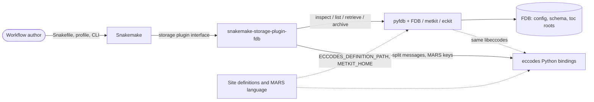
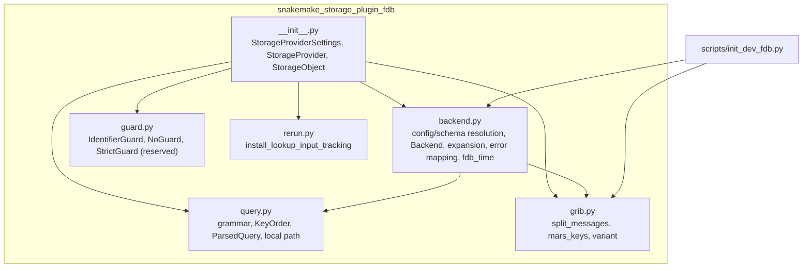
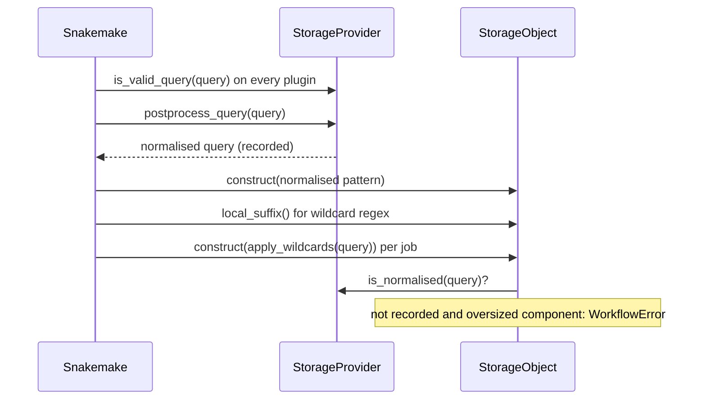
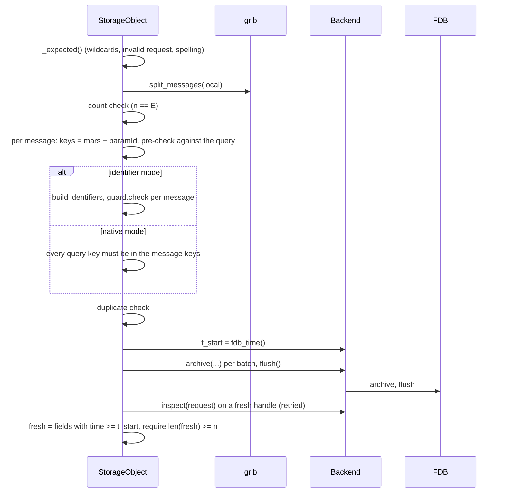

# snakemake-storage-plugin-fdb — Architecture

Status: living document, kept consistent with the code and with
[`requirements.md`](requirements.md). Structure loosely follows arc42, with C4-style
context and container/component views.

Evidence labels: **[verified: how]** was checked by reading the named source or by
running it; **[assumed]** was not. Verification started on 2026-09-15. Unless stated
otherwise, "source" refers to `snakemake-interface-storage-plugins` 4.4.1, `snakemake`
9.27.0 and `ecmwf/fdb` at `63672ea` (5.23.4).

## 1. Introduction and goals

### 1.1 Requirements overview

The plugin lets Snakemake rules read GRIB fields from FDB and write rule outputs into
FDB, addressed by one-line MARS-style queries (`fdb://class=od,...,step=0/6/12,...`).
One query may address several fields and maps to one local file. The requirements, with
IDs and verification, are in [`requirements.md`](requirements.md).

### 1.2 Quality goals

| priority | goal | requirements |
|---|---|---|
| 1 | Correct Snakemake semantics despite FDB's constraints (immutable, masked overwrites, no per-field deletion) | FR-READ-*, FR-STORE-*, FR-REMOVE-001 |
| 2 | Site neutrality: generic package, sites configured from outside | NFR-NEUTRAL-001, NFR-NEUTRAL-002 |
| 3 | Fail early and clearly; never leave half-written state silently | NFR-REL-001, FR-ERR-* |
| 4 | Cheap DAG building without native libraries | NFR-PERF-001 |

### 1.3 Stakeholders

See [`requirements.md`](requirements.md) §1.3.

## 2. Constraints

- Technical: Python ≥ 3.11 on Linux; pyfdb wheels bundle FDB, metkit, eckit and eccodes
  and pin the whole native stack (§13.7); the Snakemake storage plugin interface 4.x;
  FDB semantics (§13.4–§13.6).
- Organisational: BSD-3-Clause, copyright MeteoSwiss; `uv`-managed; the package layout
  mirrors `poetry scaffold-snakemake-storage-plugin` (src layout, `tests/test_plugin.py`,
  ruff), built with hatchling; Snakemake discovers the plugin by its module-name prefix
  `snakemake_storage_plugin_`.
- Conventions: see [`contributing.md`](../contributing.md).

## 3. Context and scope

### 3.1 System context

| neighbour | what crosses the boundary |
|---|---|
| Snakemake | provider construction with settings, `is_valid_query`, `postprocess_query`, storage objects per query (`exists`, `mtime`, `size`, `inventory`, `retrieve_object`, `store_object`, `remove`, `list_candidate_matches`), local paths under `.snakemake/storage/` |
| pyfdb / FDB / metkit | `FDB(config, user_config)`, `inspect`, `list`, `retrieve`, `archive`, `flush`; internal `FDBToolRequest` for request expansion; `RuntimeError`s |
| eccodes | message splitting, `mars` namespace keys, `paramId`; zeroed variants for tests and the dev FDB |
| FDB configuration | config YAML (file, inline or from FDB's environment variables) naming a schema file and roots |
| Site definitions, language | eccodes definitions directories and a metkit home, passed as paths through settings or environment variables |

### 3.2 Scope boundary

Inside: the package `src/snakemake_storage_plugin_fdb/`. Outside but in the repository:
`scripts/init_dev_fdb.py`, `examples/ecmwf/`, `examples/meteoswiss/`, `tests/`, CI and
docs. Site material never enters the package (ADR-017).

## 4. Solution strategy

- **Query = one MARS request = one local file** (ADR-001), with a purely syntactic
  normalisation at DAG time and value checks at run time (ADR-002).
- **Everything FDB-specific behind `backend.py`**, imported lazily after the process
  environment is prepared (§8.3).
- **`exists` = all expected fields present**, computed from metkit's expansion (§8.8,
  ADR-005); FDB index timestamps as mtimes (§8.7).
- **Store = check everything checkable before archiving, then post-check** through a
  fresh read (§6.4, §8.6).
- **Never delete** (ADR-008); reruns mask.
- **Generic settings and environment pass-throughs** instead of site code (ADR-016,
  ADR-017).

## 5. Building block view

### 5.1 Level 1: package and surroundings

Dependencies point one way: `query.py`, `grib.py` and `rerun.py` import nothing from the
package (`guard.py` imports types only; `rerun.py` imports Snakemake lazily);
`backend.py` uses `query` and `grib`; `__init__.py`
composes all of them.

### 5.2 `query.py` — query language

Pure Python; imports no `pyfdb`, `eccodes` or metkit (NFR-PERF-001).

- `parse`, `normalize` and the order-independent `validate` implement the grammar and
  the syntactic normalisation (FR-QUERY-001…007). All errors are `QueryError` (a
  `ValueError`).
- Values are sequences of *pieces*, literal text or atomic wildcard tokens (the
  interface's `WILDCARD_REGEX`), so `,`, `/` and `=` split only literal text.
- `KeyOrder` is the canonical key order (§8.1). `ParsedQuery` holds the pairs in that
  order and derives the request, the local suffix and oversized components
  (FR-PATH-001…004).
- `comparable(key, value)` normalises values for the identifier pre-check
  (FR-STORE-005).

### 5.3 `grib.py` — GRIB helpers

`eccodes` is imported inside the functions, so importing the module loads no native
library and eccodes sees the definitions the provider exported (§8.3). The module never
reads or changes `ECCODES_DEFINITION_PATH`.

- `split_messages(path)` returns `GribMessage`s (offset, length, bytes, `mars` keys,
  paramId) and raises `GribError` (a `ValueError`) for anything but NUL padding outside
  messages (FR-STORE-001).
- `mars_keys(bytes)`, and `variant(template, **keys)` for zeroed copies with changed keys
  (tests and the dev FDB script).

### 5.4 `backend.py` — pyfdb access layer

`pyfdb` is imported lazily (first handle or `Backend.expand()`). Nothing here changes
the process environment.

- Pure-Python configuration helpers: `resolve_config` (FR-CONF-002),
  `resolve_schema_path`, and `parse_schema`, which returns `SchemaInfo(keys, optional,
  removed, defaults)` with decorations merged over all rules (FR-QUERY-009,
  FR-QUERY-010).
- `Backend`: a per-thread archiving handle and a fresh handle per read (§8.6);
  `inspect`, `list`, `retrieve_to` (atomic, FR-READ-007), `archive`, `flush`, `expand`
  (§8.8) and `spelling_diffs`. It propagates pyfdb's `RuntimeError`s; callers map them
  with `map_error` (§8.4); `is_transient` classifies them for the retry policy (§8.5).
- `Field(key, length, timestamp, uri_path)`: one inspected or listed field (`length` 0
  and `uri_path` `None` below level 3).
- `fallback_expand` and `count_fields` (§8.8), `fdb_time()` (§8.7).

### 5.5 `guard.py` — identifier guard hook

The `IdentifierGuard` protocol (`check(message, identifier, query)`),
`IdentifierMismatch`, `NoGuard` (never raises), the reserved `StrictGuard` (its
constructor raises `NotImplementedError`) and `make_guard(settings)`. See ADR-013 and
requirements.md D-001.

### 5.6 `rerun.py` — input tracking by lookup

`install_lookup_input_tracking(logger)` patches
`snakemake.persistence.PersistenceBase._input_changed` once per process so that a storage
input whose object declares `tracks_input_changes = False` counts as changed only when
its object's `covered_by()` says that the recorded queries do not cover its fields
(FR-RERUN-001, ADR-034, §8.10). `decide(objects, current, recorded)` holds that
comparison; the import of Snakemake happens inside the installer.

### 5.7 `__init__.py` — Snakemake integration

- `StorageProviderSettings`: the plugin settings, all `Optional[str]`
  ([reference](../reference.md#settings)).
- `StorageProvider.__post_init__` runs: choice settings and `identifier_check` →
  `glob_required_keys` → `input_tracking` (§8.10) → environment (§8.3) → `config`/`user_config` → schema path and
  `SchemaInfo` → `key_order` → lazy import of `eccodes` and `pyfdb` → `Backend` →
  guard. `postprocess_query` records its results for `is_normalised` (FR-PATH-004), and
  `field_set(query)` caches the fields of a query for the rerun decision (§8.10).
- `StorageObject(StorageObjectRead, StorageObjectWrite, StorageObjectGlob)`: the parse
  result and the request expansion are cached per query text (FR-PATH-005, §8.2);
  `_fields()` is one retried `inspect`, never cached (FR-READ-010), keeping only the
  fields whose key contains every query key FDB indexes (`_indexed_keys()`, §13.4). Read
  methods, `store_object` (§6.4), `remove` and `list_candidate_matches` build on them;
  `covered_by` (§8.10) asks the provider's `field_set` instead.
- Module-level state, each lock-protected: `_APPLIED` (values applied by providers, to
  warn on disagreement), `_SPELLING_WARNED` and `_REMOVE_WARNED` (once-per-process
  warnings).

### 5.8 Outside the package

| path | role |
|---|---|
| `scripts/init_dev_fdb.py` | generic dev FDB creation and seeding (FR-DEV-001); no site flags |
| `examples/ecmwf/` | generic two-rule workflow (`run:` rules, untagged provider) |
| `examples/meteoswiss/` | site material: `realtime-varda.schema`, tagged `profile/config.yaml`, `Snakefile` (`shell` rule, glob), `grib_keys.py`, `setup.sh`, `make_metkit_home.py`, `fetch_ogd_samples.py` |
| `tests/` | generic suite on the samples in `tests/data/grib/ecmwf/`; `tests/sites/meteoswiss/` site suite configured by `SMK_FDB_TEST_*` variables (§8.9) |
| `tests/data/` | test schemas (plugin, pyfdb, ECMWF multi-rule); `grib/ecmwf/` committed ECMWF samples, `grib/meteoswiss/` committed OGD samples (ADR-019) |
| `.github/workflows/ci.yml` | `lint`, `test`, `site-meteoswiss` (required), `pyfdb-latest` (canary) (ADR-026) |

## 6. Runtime view

### 6.1 DAG build and normalisation

1. `is_valid_query` is called on every installed plugin for each `storage(...)` query
   without a provider, and again on the substituted query (§13.8); it parses without
   ordering.
2. `postprocess_query` normalises in the provider's key order and records the result;
   invalid queries are returned unchanged.
3. Snakemake builds wildcard regexes from `local_prefix / local_suffix()`. After
   substitution it constructs storage objects directly from `apply_wildcards(query)`
   without `postprocess_query`, so `local_suffix` must commute with substitution
   (FR-PATH-002) and oversized substituted components are rejected (FR-PATH-004).
4. Snakemake may rewrite `query` on copies to inject wildcard constraints; the object
   re-parses when `query` changes (FR-PATH-005).
5. A spawned job process (local executor for `run:` rules and shadow jobs; cluster and
   remote executors for every job) runs `python -m snakemake --target-jobs ...`, which
   re-parses the Snakefile, so every `storage.<name>(...)` call passes through
   `postprocess_query` again and constant queries are recorded there too [verified:
   snakemake 9.27.0 `executors/local.py:174-185,226-233`,
   `snakemake_interface_executor_plugins/executors/real.py:82-88,144-170`,
   `spawn_jobs.py:259-300`, `api.py:382-415`, `dag.py:264-275`, `rules.py:855-880`].

No native library is loaded in steps 1–4 except by provider construction (§8.3).

### 6.2 Inventory, exists, mtime and size

1. During DAG building Snakemake calls `inventory(cache)` once per object: one `inspect`
   fills `exists_in_storage`, and for existing objects `mtime` (`Mtime(storage=...)`) and
   `size` (FR-READ-009).
2. After DAG building the IO cache is deactivated; `exists()`, `mtime()` and `size()`
   each call `_fields()`: `_request()` (no wildcards) → `_expanded()` (metkit
   expansion, spelling check; invalid requests fail here before FDB I/O) → retried
   `Backend.inspect` on a fresh handle (§8.5, §8.6).
3. `exists` compares the count of fields carrying every indexed query key with `E`
   (§8.8). `mtime` is the maximum field time (index timestamp, else `os.stat`). `size`
   sums message lengths.
4. `exists` and `inventory` take the result from `_exists(fields)`: `0 < n < E` warns with
   `_missing_message` once per query and process, `n = 0` only logs it at debug level
   (FR-READ-008). Snakemake never reaches `retrieve_object`'s error for an object it was
   told does not exist.

### 6.3 Retrieve

1. `_fields()`; if incomplete, raise the missing-field report (FR-READ-008), computed
   from the expansion in canonical key order.
2. `Backend.retrieve_to(request, local_path, expected=sum(lengths))`, retried: fresh
   handle, `retrieve`, `readinto` 8 MiB chunks into `<local>.part`, fsync, byte-count
   check, `os.replace`; on any error the part file is removed.

### 6.4 Store with post-check

1. `_expected()` fails early for wildcards, invalid requests and spelling errors.
2. `split_messages` (GRIB errors mapped, FR-STORE-001); count check (FR-STORE-002).
3. Per message `values = mars + {param: paramId}`, pre-checked against
   `_allowed_values()` (FR-STORE-005) in both modes (`_checked_values`, ADR-032).
   Identifier mode then builds the identifier from schema keys, canonical single query
   values (`_canonical_single_values()`) and message values (FR-STORE-004,
   FR-STORE-006), and calls `guard.check` (FR-STORE-008); batch: one `(message bytes,
   identifier)` per message. Native mode additionally requires every indexed query key
   (`_indexed_keys()`) to be present in `values` (`_require_indexed_keys`,
   FR-STORE-003); keys are those `values`; one batch of the concatenated message bytes
   (NUL padding dropped).
4. Duplicate keys → error (FR-STORE-007). Up to here nothing was archived.
5. `t_start = fdb_time()` (§8.7); `_archive` archives the batch and flushes once on this
   thread's handle; a failure after a successful call reports how many calls succeeded
   (FR-STORE-010). `store_object` is not retried.
6. Post-check: `_fields()` (fresh handle, fields carrying every indexed query key),
   count fields with time ≥ `t_start`; fewer than `n` → error naming the messages whose
   key, on the indexed query keys, no fresh field has (`_offenders`) and saying the
   fields stay in FDB (FR-STORE-009).
7. Snakemake then touches the local file with `mtime()` and checks `exists_in_storage`
   (§13.8).

### 6.5 Glob

1. Snakemake calls `list_candidate_matches()` on the pattern object and matches each
   candidate with `re.match(regex_from_filepattern(pattern), candidate)`.
2. Required keys (`glob_required_keys`) must be constant, else error before I/O.
3. One retried `Backend.list(constant_pairs)` (level 3, masked fields excluded, fresh
   handle).
4. For each listed field with non-empty values for all wildcard-bearing keys, emit the
   pattern's pairs with those values replaced; return sorted unique candidates
   (FR-GLOB-001, FR-GLOB-002).

### 6.6 Remove

Snakemake's code path calls `managed_remove()` before a job runs on every output that
exists in storage, on job-failure cleanup, for `--delete-all-output` and for temporary
outputs (§13.8); of these only `--delete-all-output` is observed to reach an FDB output
in 9.27, and temporary storage outputs cannot be written at all. `remove()` applies
`remove_policy` and never deletes (FR-REMOVE-001). A rerun archives new fields that mask
the old ones.

## 7. Deployment view

- Distribution: a pure-Python wheel (`uv build`) installed into the Snakemake
  environment; pyfdb and eccodes wheels bring the native libraries.
- Runtime: the plugin runs in the Snakemake main process and in every spawned job
  process; each process prepares its own environment and opens its own handles.
- FDB: local toc FDBs on shared or local file systems, configured per provider. Dev FDBs
  live in git-ignored `.fdb/` (and `.fdb-mch/` for the MeteoSwiss example); test FDBs in
  pytest's temporary directories.
- CI: GitHub Actions on `ubuntu-latest` (glibc ≥ 2.28 for the `manylinux_2_28` wheels).

## 8. Crosscutting concepts

### 8.1 Canonical key order

Per provider, in precedence: `key_order` setting; the schema's key order; the generic
order `class, expver, stream, domain, date, time, type, levtype, levelist, step, number,
param`. Unlisted keys follow alphabetically. The generic list holds no site keys, so
`model`, `timespan` and `quantile` sort alphabetically unless the schema or setting
places them.

Schema parsing mirrors fdb5: `SchemaParser.cc:49,53` constructs `eckit::StreamParser(in,
true)`, whose comment character defaults to `#` (`eckit/parser/StreamParser.h:38`) and is
skipped to the end of line anywhere (`StreamParser.cc:64-79`) [verified: source]. pyfdb
exposes no parsed schema; `fdb.config()` returns the config including the `schema` path
[verified], so the plugin parses the text itself, before importing pyfdb.

The MeteoSwiss `realtime-varda.schema` yields
`date, time, stream, class, expver, model, type, domain, levtype, number, step, param, levelist, timespan`
without built-in knowledge (`domain` from `domain-` keeps its position).

Because the order is a provider property, different providers may order the same query
differently; their local prefixes differ anyway (FR-PATH-006).

### 8.2 Canonical spelling

`postprocess_query` never touches values (ADR-002). At run time the object's metkit
expansion gives canonical spellings: `2t`→`167`, `T_2M`→`500011`, `EA`→`ea`,
`ICON-CH1-EPS`→`icon-ch1-eps`, `2020-01-01`→`20200101`, `time=0`→`0000`,
`expver=1`→`0001`. `Backend.spelling_diffs(parsed, expanded)` compares item by item
(whole value if counts differ), skipping ranges (their expansion is long) and wildcard
keys. The check runs once per object and query text, because `_expanded()` caches only
successful computations; with `error` it therefore repeats on every call. eccodes-cosmo-mars
emits `model` upper-case in the GRIB `mars` namespace while FDB lists it lower-case, so
MeteoSwiss users copying `grib_ls -n mars` output see the warning until they lower-case
it. The evalml read path is consistent with this: it builds requests from FDB's own
`combined_key()` values.

### 8.3 Environment precedence and lazy imports

Applied in `StorageProvider._prepare_environment`, before `pyfdb`/`eccodes` are
imported. All values are validated and computed first, then exported under a lock in one
`os.environ.update`.

| variable | already set by the user | setting | result |
|---|---|---|---|
| `ECCODES_DEFINITION_PATH` | kept | `eccodes_definitions` | `<setting dirs>:<existing>`; if unset, `<setting dirs>` only (the wheel appends `/MEMFS/definitions` itself [verified: `codes_definition_path()`]) |
| `METKIT_HOME` | kept, validated | `metkit_home` | setting wins; logged at info level |
| `FDB_CONFIG`, `FDB5_CONFIG`, `FDB_CONFIG_FILE`, `FDB5_CONFIG_FILE`, `FDB_HOME` | kept; the plugin never sets them | `config`, `user_config` | passed to `FDB(config, user_config)`, which takes precedence inside FDB [verified] |
| `ECKIT_EXCEPTION_IS_SILENT` | kept | – | set to `1` if unset |
| any | kept | `env` | explicit override |

Order: (1) `env`; (2) prepend `eccodes_definitions` unless the value after (1) already
equals or starts with those directories (a second provider with the same setting, the
untagged twin Snakemake registers for a tagged provider, a spawned job inheriting the
exported value); (3) `metkit_home` replaces the value after (1); (4) the effective
`METKIT_HOME` must contain `share/metkit/language.yaml`; (5) `ECKIT_EXCEPTION_IS_SILENT`.
Providers applying different definitions or homes log a warning; for `METKIT_HOME` the
last value is exported, for `ECCODES_DEFINITION_PATH` the last provider's directories
end up first.

Lazy imports keep `snakemake --help`, `is_valid_query` and `postprocess_query` free of
native libraries (NFR-PERF-001): `query.py` imports none; `grib.py` imports eccodes
inside functions; `backend.py` imports pyfdb in `_open()` and `expand()`; the provider
imports both at the end of `__post_init__`. Caveat: a Snakefile that imports `eccodes`
at top level loads it earlier; eccodes usually reads the definition path when
definitions are first needed [assumed], and `METKIT_HOME` is read at first expansion
[verified]. Recommended: set such variables in the profile or shell before Snakemake
starts. No setting uses the interface's `env_var` mechanism.

### 8.4 Error mapping

`backend.map_error(exc, query, local=None)` turns known failures into `WorkflowError`;
the storage object applies it in `_mapping_errors(local)` around every backend call and
around `split_messages`, raising the mapped error `from exc` or re-raising unknown ones
(the `managed_*` wrappers wrap those). Every FDB or metkit failure reaches Python as a
plain `RuntimeError` (§13.11); matching is by substring, in order:

| message contains | raised as |
|---|---|
| `UserError` | `Invalid MARS request <query>: <detail>` (+ `metkit_home` hint if `cannot expand`) |
| `Cannot find a metkit SplitterBuilder` | `<local file or query> is not GRIB` |
| `Keywords not used`, `Could not find [`, `Could not find a rule` | `GRIB keys do not match the FDB schema for <query> (<local>): <detail>` |
| `Cannot open`, `No writable roots available` | `FDB configuration error: <detail>` (+ the no-configuration hint if the detail names `fdb5lib/etc/fdb/schema`) |
| `Failed system call`, `Failed to mkdir`, `Permission denied`, `No space left on device`, `Read-only file system` | `FDB I/O error for <query>: <detail> (check permissions, free space and the roots in the FDB configuration)` |
| (no exception) a lookup short of fields while a configured local root exists but is not readable (`Backend.check_roots`) | `FDB I/O error for <query>: FDB root <path> is not readable (check permissions, ...)` |
| (`GribError`) | its message |
| other | re-raised |

`_kind` does the marker scan; `map_error` formats the row it returns, and `is_transient`
(§8.5) treats an unmatched exception as transient. `<detail>` is the first non-empty
line with leading `UserError: ` and `Serious bug: ` prefixes removed (metkit doubles the
prefix), cut before ` request=` (metkit appends the request and its expansion) or the
first `;`, without a trailing ` (Success)` (§13.7), and truncated to `DETAIL_MAX` = 200
characters with `…`, so the plugin's sentence and any hint after it stay readable
(FR-ERR-001). `StorageObject._mapping_errors`, the one place that raises the mapped
error, logs the full text at debug level on the provider's logger.

`resolve_config` adds the mangled-tagged-setting hint of FR-ERR-005 when a value that is
neither a file nor a YAML mapping matches `TAG:<existing file>` (L-19).

### 8.5 Retries

`_retry_fdb_io(f) = retry_decorator(f).retry_with(reraise=True,
retry=retry_if_exception(is_transient))`: the interface's tenacity policy (3 attempts,
exponential wait from 3 s), but raising the last attempt's own exception so it can be
mapped (hence the direct `tenacity` dependency) and retrying only failures that may be
transient. Applied only to `StorageObject._inspect`, `_retrieve_to` and `_list`, which
back `exists`, `mtime`, `size`, `inventory`, `retrieve_object`, the store post-check and
glob.

`backend.is_transient(exc)` is true for an `Exception` that `_kind` (§8.4) does not
classify: everything the mapping table lists — invalid request, not GRIB, schema
mismatch, configuration error, OS-level I/O error and `GribError` — is permanent and
raised on the first attempt; any other `Exception` is retried, and `BaseException`s
(`KeyboardInterrupt`) are never retried, as with tenacity's default predicate (ADR-033).
Plugin logic errors (invalid request from expansion, missing fields, spelling
errors, `FileNotFoundError` from `mtime`) are raised outside the retried helpers and
never retried either. Archiving is never retried (ADR-028).

### 8.6 FDB handles: fresh reads, per-thread archives

A pyfdb handle that has read a database keeps a stale catalogue: later archives, by
any handle, stay invisible to it (§13.5). `Backend.reader()` therefore opens a new
`pyfdb.FDB` for every `inspect`, `list` and `retrieve`, which is cheap (§13.5).
Archiving uses one handle per thread (`threading.local`), because sharing handles across
threads is unsupported; `flush()` flushes that handle only. `cleanup()` has nothing to
do. Without fresh reads, `mtime()` and `retrieve_object()` after a re-store, or an input
read after its producer stored it, would see old fields (ADR-014).

### 8.7 The FDB clock

FDB stamps each index with `time()` at flush (§13.3). glibc `time()` reads the kernel's
coarse realtime clock, which lags `time.time()` by up to one tick, so just after a
second boundary a flush can get the previous second. `backend.fdb_time()` calls libc
`time()` itself through `ctypes.CDLL(None)` (the symbol `libfdb5.so` imports), falling
back to `int(time.time())` with a debug log where libc cannot be loaded. The store
post-check takes `t_start` from it (ADR-015). Linux file mtimes, used by the `os.stat`
fallback, come from the same coarse clock.

### 8.8 Request expansion and expected field count

`Backend.expand(request)` maps the request with pyfdb's internal
`UserInputMapper.map_selection_to_internal` and
`FDBToolRequest.from_internal_mars_selection(...).tool_request`, and parses its repr
(`retrieve,` then one `\tkey=v1/v2,` line per key) with `^\t?(\w+)=(.*)$`. It returns
`None` if the internal API is missing, changed shape or its repr does not parse; the
object then uses `fallback_expand` (lists, integer and `YYYYMMDD` ranges; other ranges
kept verbatim, which over-counts — conservative for `exists`) and logs once at debug
level. An invalid request raises metkit's `RuntimeError`, mapped to "Invalid MARS
request". `E = count_fields(expanded)` = product of distinct values per key (aliases are
not de-duplicated by the repr, hence "distinct"). The storage object passes its cached
expansion to `spelling_diffs`, so metkit expands once per object.

### 8.9 Testing concept

- Generic tier (`tests/`): unit tests without FDB (`test_query.py`, `test_key_order.py`,
  `test_settings.py`, `test_no_site_specifics.py`), eccodes tests (`test_grib.py`),
  backend and plugin tests against temporary toc FDBs seeded from
  `tests/data/grib/ecmwf/` and in-memory zeroed variants (`test_backend.py`,
  `test_plugin.py`, fixtures in `conftest.py`), and end-to-end Snakemake runs
  (`test_workflow.py`, and `test_rerun.py` for the rerun scenarios, which also tests the
  input-tracking patch against a stub and against the real `PersistenceBase`). Tests
  needing the ECMWF samples skip without them.
- Interface conformance: `TestStorageRead` (`retrieve_only`, because the base test writes
  the text `test` before `store_object`) and `TestStorageWrite` (overwrites that text
  with GRIB for the query) derive from `FDBStorageBase(TestStorageBase)` with
  `files_only = True`, `touch = False`; no base test is disabled.
- Site tier (`tests/sites/meteoswiss/`, marker `site_meteoswiss`): required in CI;
  prerequisites from `SMK_FDB_TEST_*` variables, each missing one a separate skip reason,
  or a failure with `SMK_FDB_TEST_REQUIRE_SITES=1`. FDB access runs in subprocesses,
  because definitions and the MARS language must be set before the libraries load and
  metkit reads the language once per process. The package is exercised only through
  public settings or plain environment variables.
- End-to-end runs execute copies of the shipped examples in clean subprocess
  environments (`subprocess_env`, `run_logged` in `tests/conftest.py`): the generic one
  with untagged settings, the site one with its tagged profile and without site
  variables, whose `.local/` paths are overridden by `mch::` values on the command line.

### 8.10 Rerun triggers and input tracking

Snakemake decides a rerun from the triggers in `--rerun-triggers` (default: all of
`mtime`, `params`, `input`, `software-env`, `code`). For FDB inputs only `mtime` is
meaningful: `inventory`/`mtime` give the index timestamps of the fields (FR-READ-004),
which Snakemake compares with the outputs, and `exists` decides whether the producer
runs at all (FR-READ-001). The `input` trigger, in contrast, compares the *text* of the
recorded input queries (§13.8), which changes whenever a query is edited, even when it
selects the same fields.

Hiding FDB inputs from the `input` trigger is not enough, because that trigger is also
what brings *new* work into an up-to-date part of the DAG: only target jobs evaluate
their missing outputs directly, other producers are pulled in by a consumer that already
needs to run (`dag.py:1468-1535`, `1622-1665`, §13.8). A parameter added to an up-to-date
consumer would then produce nothing at all.

`input_tracking=lookup` (the default) therefore decides the trigger for this plugin's
inputs by **field coverage**: `rerun.py` wraps `PersistenceBase._input_changed` and, when
the original reports a change, re-decides it (ADR-034). Snakemake records storage inputs
by query text as it does for every plugin, so the metadata records are unchanged.

The decision (`rerun.decide`) partitions both lists. The current FDB entries are the
job's inputs whose storage object declares `tracks_input_changes = False`:
`StorageObject.tracks_input_changes` is false unless the object's provider has
`input_tracking=query`, so two tagged providers can differ, and objects of other plugins
have no such attribute and keep the text comparison. Everything else is compared as the
original does (the same entries with the same multiplicities): a current entry no record
matches, or an unmatched recorded entry that no tracked object's provider accepts as a
query (`is_valid_query`), is a change; the remaining unmatched recorded entries are the
pool, and the input set changed iff some object is not `covered_by` it.

`StorageObject.covered_by(recorded)` is true at once when its own text is in the pool.
Otherwise it expands every query with metkit (§8.8) and compares **fields**: one field
is the tuple of `key=value` pairs of one element of the product of the expanded values,
so the order of keys and values, list or range notation and non-canonical spellings do
not matter, while a key that only one query names makes their fields differ (the pair is
part of the field's identity). Recorded queries are expanded from their text alone, not
through a storage object, so a stale record triggers no spelling warning. The expansions
are cached per query text on the provider (`field_set`), because a job's recorded
queries repeat across its outputs and across jobs; a query that metkit rejects, or that
names more than `COVERAGE_MAX` fields, covers nothing (debug log, L-21). A job whose
record holds no FDB query at all — a record written by 0.2.0, which hid them — is
therefore rerun once.
The `params`, `code` and `software-env` triggers are untouched, and a failure inside the
decision falls back to Snakemake's answer.

The patch is installed once per process, by the first provider constructed with
`input_tracking=lookup`, which happens while the Snakefile is parsed and thus before the
DAG is built. Spawned job processes (`run:` rules under the local executor, cluster
jobs) construct the provider too, but records are written and compared by the main
process only (§13.8). The patch is guarded: a missing attribute or an unexpected
signature gives a warning and Snakemake's behaviour (L-21, R-14). `input_tracking=query`
skips it.

## 9. Architecture decisions

All decisions are dated 2026-09-15 (design and implementation) unless the entry gives
another date. "Accepted
(reversible)" marks decisions recorded as reversible; they may be changed without a new
design round, provided requirements, architecture and code are updated together.

### ADR-001 Read-write plugin with multi-field queries

- Context: rules need sets of fields (steps, parameters, members); FDB addresses fields
  by MARS keys.
- Decision: a read-write plugin; one query is one MARS request that may address several
  fields (`/` lists, `to`/`by`) and maps to one local GRIB file.
- Status: accepted.
- Consequences: `exists` must define completeness (ADR-005); stores must check field
  counts; wildcard values must be single values.

### ADR-002 Syntactic normalisation, runtime value checks

- Context: value canonicalisation needs metkit; `postprocess_query` runs for every query
  during DAG building.
- Decision (user): `postprocess_query` only strips whitespace, lower-cases and orders
  keys; values stay verbatim. Canonical spelling is checked at run time with a policy
  (`canonical_spelling`, default `warn`).
- Status: accepted.
- Consequences: cheap, deterministic DAG builds identical without native libraries;
  the same field spelled twice gives two local paths (L-1); users are told to use
  canonical spellings.

### ADR-003 Key order from setting, schema or generic list

- Context: key order must be stable under substitution and site-neutral.
- Decision: precedence `key_order` → schema key order (pure-Python parse) → generic MARS
  order; unknown keys alphabetical.
- Status: accepted.
- Consequences: site schemas give site orders without site code; the plugin mirrors
  FDB's config and schema resolution (FR-QUERY-010).

### ADR-004 Local path layout and over-long components

- Context: local copies must be readable, collision-free and usable by wildcard regexes.
- Decision: `key=value` directories, `/`→`+`, `.grib`; components over 255 bytes hashed
  (`key=~<sha256[:24]>`) when constant, rejected with a wildcard; unrecorded queries
  with oversized components rejected at construction (the guard was decided on
  2026-09-15 after verifying that job processes re-parse the Snakefile).
- Status: accepted.
- Consequences: commutation with `apply_wildcards` holds; list values in wildcards are
  unsupported.

### ADR-005 `exists` requires all expected fields

- Context: a multi-field object can be partially present.
- Decision: `exists` = `E > 0` and exactly `E` fields found.
- Status: accepted.
- Consequences: incomplete inputs trigger producers or "missing input"; a store of
  fewer fields is always an error (ADR-032); `E` is a cross product (L-4). evalml's completeness check is the same
  idea at block granularity.

### ADR-006 No storage checksum

- Context: Snakemake consults checksums only with a local copy and hashes the local file
  when `checksum()` is `None`.
- Decision: return `None`; never write the checksum cache.
- Status: accepted.
- Consequences: a metadata pseudo-checksum (would need a hashlib prefix, be compared
  against real hashes and `ensure(sha256=...)`, cause spurious reruns) and hashing
  retrieved bytes (costs a full retrieve) are avoided.

### ADR-007 Per-object inventory

- Context: `inventory()` runs once per file during DAG building.
- Decision: one `inspect` per object; no inventory parent.
- Status: accepted.
- Consequences: database- or index-level listings (10^5–10^6 fields) are avoided; blocking
  inside the coroutine is accepted, as in the http plugin.

### ADR-008 `remove()` never deletes

- Context: FDB cannot delete single fields; `wipe` deletes indexes or whole databases
  (§13.6).
- Decision: `remove_policy` `warn` (default), `ignore` or `error`; never delete.
- Status: accepted.
- Consequences: `--delete-all-output` leaves fields (and does not make the producer
  rerun); reruns mask;
  `fdb purge` is manual. A future `wipe` policy only with proof of full index coverage
  (requirements.md D-006).

### ADR-009 `archive_mode` defaults to `native`

- Context: the earlier default `identifier` rested on storing `template.grib` under
  `tests/data/pyfdb-tests.schema` and on MeteoSwiss GRIB assumed not to carry every
  schema key. The MeteoSwiss assumption was disproven: native archives of all OGD
  samples under `realtime-varda.schema` work (§13.10). Under
  `tests/data/ecmwf-fdb-tests.schema` (ECMWF's multi-rule test schema, 56 keys),
  identifier mode treats every key mandatory in any rule as required, and 24 keys cannot
  be determined for the ECMWF samples (`country`, `dbase`, `rki`, `rty`, `ty`,
  `bcmodel`, `icmodel`, `fcmonth`, `dataset`, `anoffset`, `georef`, `ident`,
  `instrument`, `stattype`, `obsgroup`, `reportype`, `reference`, `refdate`,
  `diagnostic`, `fcperiod`, `offsetdate`, `offsettime`, `leadtime`, `opttime`), while
  native archives of `synth11`, `steprange`, `template` and `quantile` succeed
  [verified: schema analysis and native archive runs].
- Decision (user): default `native`; `identifier` remains for single-rule schemas and
  GRIB lacking a schema key (e.g. `template.grib` under `tests/data/pyfdb-tests.schema`,
  where native fails with `Keywords not used: {number}`). Supersedes the identifier
  default.
- Status: accepted (reversible).
- Consequences: no rule matching in the plugin; identifier mode's multi-rule limitation
  documented (L-17); native mode is pyfdb's recommended path and MeteoSwiss's production
  path.

### ADR-010 Identifier mode checks single-valued query keys

- Context: previously a single-valued query key overrode the message value unchecked;
  FDB performs no consistency check.
- Decision (user): the pre-check covers single- and multi-valued constant keys the
  message carries.
- Status: accepted (reversible).
- Consequences: contradicting labels fail before archiving; wrong labels for keys the
  message lacks and aliases the light normalisation skips remain unchecked (the reserved
  strict guard's job); relabelling needs fixing the GRIB.

### ADR-011 Identifier values in canonical spelling

- Context: FDB stores `param=167.128`, `param=2t`, `date=2020-01-01` verbatim as second
  keys and rejects `time=0`, `expver=2`, `class=EA` (§13.5).
- Decision (user): single-valued query values in identifiers use the spelling of the
  object's metkit expansion; message-derived values stay as eccodes reports them
  (FDB canonicalises `step=0m` itself); without expansion, verbatim with a debug log.
- Status: accepted (reversible).
- Consequences: identifier stores list canonical keys.

### ADR-012 Pre-check skips mixed number/string pairs

- Context: aliases such as `step=0` vs the message's `0m`, `time=00:00` vs `0000`.
- Decision (user): such pairs are not compared.
- Status: accepted (reversible).
- Consequences: conservative (never a false mismatch); the post-check still catches
  fields landing outside the query.

### ADR-013 Identifier guard hook reserved

- Context: a strict check needs FDB-exact canonicalisation and schema rule selection.
- Decision: v1 ships the `IdentifierGuard` protocol, `NoGuard`, the call site before
  archiving and the reserved `identifier_check=strict` (configuration error).
- Status: accepted; implementation deferred (requirements.md D-001).
- Consequences: adding the guard needs no new setting or call site.

### ADR-014 Fresh read handle per read

- Context: handles that have read keep a stale catalogue (§13.5); creating one is cheap.
- Decision: `Backend.reader()` opens a new handle for every read; archives use one handle
  per thread.
- Status: accepted.
- Consequences: correct answers after stores and reruns; no handle pool.

### ADR-015 Post-check uses FDB's clock

- Context: comparing index timestamps with `int(time.time())` rejected freshly stored
  fields stamped with the previous second (§13.3).
- Decision: take `t_start` from libc `time()` via `fdb_time()`.
- Status: accepted (fixed in commit `d322e59`).
- Consequences: Linux-specific `ctypes` call with a fallback; one-second resolution
  remains (L-3).

### ADR-016 Generic settings and environment handling

- Context: sites differ in FDB config, definitions, MARS language and key order.
- Decision: all settings are generic pass-throughs; `config`/`user_config` accept a file
  or inline YAML (never a path string passed to pyfdb); `eccodes_definitions` takes plain
  directories (no aliases or shorthands); `metkit_home` is validated; `env` is the one
  explicit override; precedence as in §8.3. Settings are `typing.Optional[str]`, because
  Snakemake's argument builder unwraps only `typing.Union`, not `X | None`.
- Status: accepted.
- Consequences: no site code; two tagged providers with different definitions or
  languages in one process are unsupported (L-15).

### ADR-017 Site neutrality and where site material lives

- Context: MeteoSwiss support is a first-class goal, but the package must stay generic.
- Decision (user principle): site material lives in `examples/<site>/`,
  `docs/sites/<site>.md` and `tests/sites/<site>/`; `tests/test_no_site_specifics.py`
  and the CI grep reject `mch|meteoswiss|cosmo|icon-ch` under `src/` and, since
  2026-09-15, `scripts/` (before, `scripts/` was a documentation rule).
- Status: accepted; the extension to `scripts/` is reversible.
- Consequences: MeteoSwiss users copy a profile; the site suite proves generic means
  suffice.

### ADR-018 pyfdb and eccodes pins (Option A)

- Context: pyfdb pins the whole native stack; COSMO definitions exist only for eccodes
  2.47 (§13.7, §13.11).
- Decision (user): `pyfdb>=5.21.4.21,<5.22`, `eccodes>=2.47,<2.48` (Option A). Option B
  (`pyfdb>=5.23.2.27,<6`, `eccodes>=2.48,<3`) was rejected for the first release. The
  version warning appears on both series, so it did not discriminate.
- Status: accepted.
- Consequences: same stack as evalml, macOS wheels available, newer FDB fixes forgone;
  a non-blocking CI canary on 5.23 signals when the pin can be lifted (requirements.md
  D-002); no `pyfdb.__version__` (use `importlib.metadata`).

### ADR-019 Test data in git

- Context: CI needs reproducible samples; OGD data expires after 24 h.
- Decision (user, supersedes "not in git"): commit the ECMWF samples
  (`tests/data/grib/ecmwf/`) and the OGD samples (`tests/data/grib/meteoswiss/`) as
  empty-data GRIB (constant field, `grid_simple`, `bitsPerValue=0`, MARS keys
  unchanged); full-size originals in the git-ignored `.local/samples-full/meteoswiss/`;
  `compare.grib` dropped (origin unknown). Tests still skip cleanly when data is absent.
- Update (user, 2026-09-15, reversible): the samples moved out of the hidden `.raw/`
  directory into `tests/data/`, next to the test schemas: `.raw/*.grib` to
  `tests/data/grib/ecmwf/`, `.raw/meteoswiss/` to `tests/data/grib/meteoswiss/`,
  `.raw/schema` to `tests/data/pyfdb-tests.schema`. The local `.local/raw-full/` became
  `.local/samples-full/` and the pytest marker `needs_raw` became `needs_samples`. File
  contents are unchanged.
- Status: accepted.
- Consequences: no downloads in CI; the fetch script only refreshes samples.

### ADR-020 OGD fetch writes full-size files by default

- Context: OGD data expires after 24 h, full-size fields are megabytes, and the
  committed samples must stay small and stable.
- Decision: `fetch_ogd_samples.py` writes full-size files to
  `.local/samples-full/meteoswiss/`; committed copies only with `--empty-data`
  (overwrite only with `--force`), keeping the committed file names; tests read
  `date`/`time` from the file names.
- Status: accepted (reversible).
- Consequences: a plain run never touches the committed samples; refreshing the samples
  is explicit.

### ADR-021 Default metkit home models

- Context: the stock MARS language rejects site `model` values; users need different
  subsets.
- Decision: `make_metkit_home.py --models` defaults to `icon-ch1-eps,icon-ch2-eps` (what
  the samples and example need); other values are passed explicitly; the list of valid
  values lives only in `docs/sites/meteoswiss.md`.
- Status: accepted (reversible).
- Consequences: one list to maintain; other models need `--models`.

### ADR-022 One examples directory

- Context: there is a generic example and a site example.
- Decision: the generic example is `examples/ecmwf/`, next to `examples/meteoswiss/`,
  instead of a separate top-level directory.
- Status: accepted (reversible).
- Consequences: further sites follow the `examples/<site>/` pattern.

### ADR-023 Generic dev FDB script

- Context: a site flag in `scripts/` would put a site mechanism outside `examples/`
  (ADR-017).
- Decision: `init_dev_fdb.py` has no site flag (`--root`, `--schema`, `--seed [DIR]`
  instead); the MeteoSwiss dev FDB is a documented command run with the site
  environment.
- Status: accepted (reversible).
- Consequences: the site command lives in `examples/meteoswiss/README.md` and is tested
  by the site suite.

### ADR-024 Explicit `--variants` flag

- Context: a generic script should not change behaviour based on a file name.
- Decision: the ECMWF example's variants are archived with `--variants [FILE]`, not as a
  side effect of `--seed` finding a file named `template.grib`.
- Status: accepted (reversible).
- Consequences: the example's one-liner is `init_dev_fdb.py --seed --variants`.

### ADR-025 Hand-maintained changelog

- Context: the user wants release notes without release automation.
- Decision (user): no release-please and no conventional-PR check; `CHANGELOG.md` in
  Keep a Changelog format with `## [Unreleased]`, updated with every user-visible change;
  CI checks only that the heading exists. Releases rename `[Unreleased]` to the version.
- Status: accepted (format reversible).
- Consequences: entries are enforced by review, not by CI.

### ADR-026 CI layout

- Context: the generic suite, the site suite and newer pyfdb releases must be checked
  without data downloads.
- Decision: required jobs `lint` (locked ruff from the dev group only, site-neutrality
  grep, changelog heading), `test` (Python 3.11 and 3.12, locked stack, coverage report
  without threshold) and `site-meteoswiss` (definitions from `setup.sh`, metkit home from
  `make_metkit_home.py`, committed samples, `SMK_FDB_TEST_REQUIRE_SITES=1`); a
  non-blocking `pyfdb-latest` canary. `.local` is not cached, because `setup.sh` tracks
  the `varda-ext` tip. `ECCODES_VERSION_CHECK_OFF` and `ECKIT_EXCEPTION_IS_SILENT` are
  not set job-wide, so the site workflow sees only what the profile's `env` passes.
  `setup-uv` uses the floating `v6` tag, because the MeteoSwiss GitHub organisation's
  action allowlist permits only `astral-sh/setup-uv@v2` and `@v6` (checked 2026-09-16;
  GitHub-owned actions such as `actions/checkout@v7` are allowed). Jobs and triggers:
  [`contributing.md`](../contributing.md#ci).
- Status: accepted.
- Consequences: a change on the `varda-ext` branch can break CI without a commit here
  (R-10).

### ADR-027 qubed not used

- Context: qubed 0.4.11 was evaluated for parsing, expansion and glob (§13.12).
- Decision: not used; take inspiration only.
- Status: accepted.
- Consequences: the cross-product bookkeeping stays a few lines of Python over metkit's
  expansion; revisit for large listings (requirements.md D-009).

### ADR-028 Retry policy

- Decision: reuse the interface's retry policy with `reraise=True` for FDB reads only;
  never retry archives.
- Status: accepted.
- Consequences: mapped errors after retries; partial archives are reported instead of
  repeated.

### ADR-029 Working around lost tagged settings in spawned jobs

- Context: spawned jobs receive tagged settings with a single colon (§11, R-1).
- Decision: `examples/ecmwf/` (`run:` rules) takes untagged settings; the MeteoSwiss
  example uses a tagged provider with a `shell` rule, which the local executor runs in the
  main process.
- Status: accepted until fixed upstream.

### ADR-030 Design documentation split

- Context: a combined specification and an implementation plan had grown historical.
- Decision: replace them with `requirements.md` and this document; user and contributor
  documentation under `docs/`.
- Status: accepted.
- Consequences: implementation history is dropped; decisions, verified facts, limitations
  and deferred work are kept in the two design documents.

### ADR-031 Interim patch of `PersistenceBase._input` for FDB inputs

- Context: Snakemake's `input` rerun trigger compares the recorded query text of storage
  inputs (§13.8), so editing an FDB query reruns the rule even when the query selects the
  same or older fields. For FDB the lookup is the state of the input (FR-RERUN-001).
  Snakemake offers no way for a storage plugin, a rule or a file to opt out of that
  trigger.
- Decision: with `input_tracking=lookup` (the default), the first provider patches
  `snakemake.persistence.PersistenceBase._input` once per process so that inputs whose
  storage object declares `tracks_input_changes = False` — this plugin's, unless their
  provider has `input_tracking=query` — are left out of the recorded list (§8.10). The
  patch is guarded and degrades to a warning; `input_tracking=query` disables it.
- Alternatives: workflow-wide `--rerun-triggers mtime params code software-env` (rejected:
  it also disables the trigger for local inputs, and it is the user's setting, not the
  plugin's); a per-rule or per-input opt-out (does not exist); recording a
  lookup-derived value instead of the query (rejected: it duplicates the `mtime` trigger
  and would rerun on every re-archive of an unrelated field of the query); doing nothing
  and documenting it (rejected: the user requires lookup-decided reruns); an upstream
  hook (the target state, requirements.md D-011).
- Status: superseded by ADR-034 (2026-09-16) in its mechanism; the `input_tracking`
  setting and `tracks_input_changes` remain.
- Consequences: a private API is patched (L-21, R-14) and a new module `rerun.py` carries
  it; the wrapper has the semantics of the proposed upstream hook, so it can be dropped
  when D-011 lands; the first run after upgrading reruns rules with FDB inputs once,
  because the recorded input set changes; local inputs and other plugins keep
  Snakemake's behaviour.

### ADR-032 Validate before archiving in every mode, never match through absent keys

- Context: native mode (the default) computed each message's MARS keys but checked
  nothing against the query; FDB archived every message under its own keys and only the
  post-check noticed, after the data was in FDB. A rule that forgot to change `expver`
  archived its output on top of its own input, masking six fields. A query key the GRIB
  does not carry (`quantile=1:10`) was archived away silently, and `inspect` then matched
  the quantile-less fields for every per-quantile query (§13.4), so `exists()` was true
  for all of them. `store_check=warn` allowed a partial store, which `exists()` (ADR-005)
  then always reported missing, so the job failed with Snakemake's generic
  `RemoteFileException` on every run.
- Decision (user): check what can be checked from the file before the first `archive()`
  in both modes (pre-check of the values, FR-STORE-005; presence of every indexed query
  key in native mode, FR-STORE-003); count fields on the read side only when their key
  contains every indexed query key (FR-READ-001; FDB matches the values of the keys a
  field carries, so only presence needs checking); remove `store_check` (FR-STORE-002);
  name the offending messages and keys when the post-check fails (FR-STORE-009). Which
  keys FDB indexes is read from the schema; without a readable schema nothing is
  required (L-15), so a missing schema never hides data or rejects a valid store.
- Status: accepted (reversible), 2026-09-16.
- Consequences: FDB is not touched by a store the plugin can reject; native mode rejects
  query keys the message lacks (L-23), which identifier mode still labels; the read-side
  filter costs one dictionary lookup per indexed query key and inspected field (pure
  Python, no extra FDB call); `store_check=warn` workflows must fix the rule instead.

### ADR-033 Retry classification by the error mapping

- Context: the retry policy retried every exception, so a permanent failure (a typo in
  the configuration, an unreadable root, an invalid MARS request reaching FDB) cost
  about 10 s per query, and a dry run over many queries became minutes of waiting
  [verified: `read-glob-config` stress test, 10.3 s for `No writable roots available`].
- Decision: derive the classification from the error mapping: whatever §8.4 maps is
  permanent, every other `Exception` is retried. `_kind`, the marker scan, is shared by
  `map_error` and `is_transient`; no second list of markers is maintained.
- Status: accepted; reversible (2026-09-16).
- Consequences: a marker added to §8.4 also stops that error being retried, which is the
  intended coupling; an unmapped permanent error is still retried three times, which is
  the safe direction. The predicate is pure and builds no message.

### ADR-034 Field coverage instead of hidden inputs

- Context: ADR-031 hid FDB inputs from the recorded input set. That makes narrowing a
  query harmless, but it also removes the only trigger that brings new work into an
  up-to-date part of the DAG: a producer that is not a target runs only when a consumer
  needs to run (§13.8), and a consumer with existing outputs becomes needrun for a new
  input through the input-set trigger alone. Adding a parameter to a workflow whose
  outputs exist therefore reported "Nothing to be done" and produced nothing [verified
  2026-09-16 with the playground pipeline].
- Decision: record storage inputs as Snakemake does and decide the comparison instead:
  wrap `PersistenceBase._input_changed` and, for inputs whose object declares
  `tracks_input_changes = False`, report a change only when the fields of the input's
  query are not all covered by the fields of the recorded FDB queries (`covered_by`,
  §8.10). Non-FDB entries keep Snakemake's comparison. The patch is guarded and degrades
  to a warning; `input_tracking=query` disables it.
- Alternatives: keeping ADR-031 and asking users to force reruns after widening
  (rejected: silent under-production is the worst failure mode); making every FDB input a
  target (rejected: not the plugin's decision, and it changes job scheduling); comparing
  the recorded field *lookup* instead of the query's fields (rejected: it duplicates the
  `mtime` trigger); an upstream hook that lets the object decide (the target state,
  requirements.md D-011, whose draft now proposes `input_changed(recorded)`).
- Status: accepted (reversible), 2026-09-16; supersedes the mechanism of ADR-031;
  interim until D-011 lands.
- Consequences: metadata records are identical to stock Snakemake's, so
  `input_tracking=query` and a removed patch need no migration, while a record written by
  0.2.0 reruns its job once; the comparison costs one metkit expansion per distinct query
  (cached per process) and enumerates the fields of a query, which is capped
  (`COVERAGE_MAX`, L-21); a widened query now reruns even when its new fields are older
  than the output, which is what the user requires.

## 10. Quality requirements

Quality scenarios are the non-functional requirements in
[`requirements.md`](requirements.md) §3 (site neutrality, performance, compatibility,
reliability, security and licensing, maintainability), each with its verification.

## 11. Risks and technical debt

| ID | risk or debt | mitigation |
|---|---|---|
| R-1 | **Upstream Snakemake: tagged settings lost in spawned jobs.** `spawn_jobs.py` (`_get_storage_provider_setting_items.fmt_value`) re-emits tagged values as `f"{tag}:{value}"` with a single colon; the job parses it as the untagged value `tag:value` [verified: settings round-trip reproduction; end to end with snakemake 9.27.0 and the local executor: `examples/ecmwf/` with `storage ecm:` and `--storage-fdb-config ecm::../../.fdb/config.yaml -c1` fails in the spawned `run:` job with `FDB configuration error: 'ecm:../../.fdb/config.yaml' is neither an existing file nor an inline YAML mapping`; still present on snakemake `main` as of 2026-09-15 at `spawn_jobs.py:376`]. No matching upstream issue was found; a draft is not posted yet. | Documented (L-19, user guide); ADR-029; report upstream (requirements.md D-004). |
| R-2 | Request expansion depends on the repr of pyfdb's internal `FDBToolRequest`. | Version pin; fallback expansion; upstream `pyfdb.expand` proposal (D-003). |
| R-3 | Index timestamps are parsed from the `ListElement` repr. | Pin; tests; upstream `timestamp()` binding (D-003). |
| R-4 | Error mapping matches message substrings verified on pyfdb 5.21.4.23. | `test_map_error_table`; the `pyfdb-latest` canary runs the suite on 5.23. |
| R-5 | pyfdb pin below 5.22 and coupling to COSMO definitions for eccodes 2.47; every decode prints a version warning. | Canary job; `ECCODES_VERSION_CHECK_OFF=1` (§13.11); D-002. |
| R-6 | A `METKIT_HOME` without `language.yaml` hangs FDB; a broken language file cannot be validated. | Existence check (FR-ENV-002). |
| R-7 | Definitions and language are read at library load; an early `import eccodes` in a Snakefile may bypass settings. | Export in the profile or shell (§8.3). |
| R-8 | One-second timestamp resolution in the post-check (L-3). | Accepted. |
| R-9 | Cross-product field count may over-count context-dependent keys (L-4). | Accepted; documented. |
| R-10 | OGD retention of 24 h makes samples unreproducible; `setup.sh` tracks the moving `varda-ext` branch tip, so CI can change without a commit here. | Committed samples; the site suite in CI surfaces breakage. |
| R-11 | COSMO definitions open `/dev/stderr` as a file, truncating a stderr redirected to a regular file (also with `ECCODES_VERSION_CHECK_OFF=1`) [verified: eccodes 2.47.3 + cosmo-mars + cosmo-resources 2.47.0.1]. | Decoding jobs log stderr to their own file (MeteoSwiss example). |
| R-12 | eckit `SeriousBug` backtraces are printed regardless of environment settings (L-7). | Accepted. |
| R-13 | `fdb_time()` uses `ctypes.CDLL(None)`, Linux/glibc-specific. | Fallback to `int(time.time())`. |
| R-14 | **Private Snakemake API.** Input tracking by lookup patches `PersistenceBase._input_changed` (ADR-034); a rename, a signature change, an override in a subclass, a changed format-version gate or a change of the recorded form of storage inputs (today `storage_object.query` verbatim, from `_input`) would silently restore query tracking or break the patch. | Guarded installation with a warning and a fallback (L-21); the signature of the hook and the recorded form are asserted by `tests/test_rerun.py::test_persistence_private_api_is_stable`; the end-to-end tests check the behaviour; `input_tracking=query` as an escape hatch; upstream hook (requirements.md D-011). |
| R-15 | FDB request semantics: `inspect`/`retrieve` match through query keys the indexed fields lack while `list` does not (§13.4, L-22); the plugin's own key check (FR-READ-001) depends on that asymmetry not changing meaning across FDB versions. | `test_exists_does_not_match_through_absent_key` pins both behaviours; the `pyfdb-latest` canary runs it on 5.23; report upstream (requirements.md D-012). |
| R-16 | **Silently unreadable databases.** An unreadable database directory under an FDB root makes `inspect` return fewer fields with no exception to map, so partial data looks like missing data and a workflow that can also produce the query would recompute and re-archive it (L-24) [verified: `chmod 000` on one `root/ea:...` directory, `read-glob-config` stress test]. `ECKIT_EXCEPTION_IS_SILENT=1` hides eckit's own message. | The partial-input warning (FR-READ-008) names the missing fields; documented in the troubleshooting table. |
| TD-1 | `SchemaInfo.defaults` is parsed but not used by the plugin; `Backend.expected_count` is used only by tests. | Keep for the strict guard (D-001) or remove. |
| TD-2 | No ECMWF sample fetch script. | D-008. |

## 12. Glossary

See [`requirements.md`](requirements.md) §1.5.

## 13. Verified external facts

Facts about pyfdb, FDB, metkit, eccodes and Snakemake that the design relies on.
Prototyping environment (2026-09-15): Python 3.12.12, `pyfdb 5.23.2.27`,
`fdb5lib 5.23.2.27`, `eckitlib 2.2.0.27`, `metkitlib 1.20.2.27`, `eccodeslib 2.48.2.27`,
`eccodes 2.48.0`, `snakemake 9.27.0`, `snakemake-interface-storage-plugins 4.4.1`,
`qubed 0.4.11`, `eccodes-cosmo-resources-python 2.47.0.1`; a second environment with
`pyfdb 5.21.4.21` (`fdb5lib 5.21.4.21`, `eccodeslib 2.47.3.21`, `metkitlib 1.18.3.21`,
`eckitlib 2.1.0.21`); the locked `pyfdb 5.21.4.23` through the test suite. Sources read:
the interface and snakemake versions above, `ecmwf/fdb` at `63672ea`
(`src/pyfdb`, `src/pyfdb_bindings/bindings.cc`, `src/fdb5/...`), the s3/http/fs storage
plugins, `poetry-snakemake-plugin`, `MeteoSwiss/eccodes-cosmo-mars` (`main`, `varda`,
`varda-ext`) and the `MeteoSwiss/evalml` diff `main...enable_fdb`. Prototype scripts were
not kept; the behaviours that matter are covered by tests. Items are
**[verified: run]** unless labelled otherwise.

### 13.1 Version facts

| pyfdb | fdb5lib → eccodeslib / metkitlib / eckitlib | wheels | COSMO definitions |
|---|---|---|---|
| 5.23.2.27 | 2.48.2.27 / 1.20.2.27 / 2.2.0.27 | `manylinux_2_28` x86_64/aarch64, cp311–cp314; no macOS/Windows | none for 2.48 (newest v2.47.0.2 on GitHub, 2.47.0.1 on PyPI); warning per message, decoding and round trip still work |
| 5.22.0.26 | not checked | – | – |
| 5.21.4.21 (evalml's lock; .22/.23 exist) | 2.47.3.21 / 1.18.3.21 / 2.1.0.21 | also macOS | same series as `eccodes-cosmo-resources-python` 2.47.0.1; warning still printed (2.47.0 vs 2.47.3) |

[verified: PyPI metadata]. pyfdb 5.21.4.x has the same public API as 5.23 (`FDB`,
`ListElement`, `DataHandle`, `URI`; no `pyfdb.__version__`, use
`importlib.metadata.version("pyfdb")`) and identical plugin-relevant behaviour
(timestamp only in repr, `inspect` with `to/by` and aliases, `retrieve.size()`, internal
expansion, `class=zz` → `UserError`).

### 13.2 ECMWF samples

Committed in `tests/data/grib/ecmwf/`; pyfdb's schema is `tests/data/pyfdb-tests.schema`.

| file | bytes | message | MARS keys |
|---|---|---|---|
| `template.grib` | 10800 | 10 732 B, GRIB1, reduced_gg, 5248 values | class=ea expver=0001 stream=enda date=20200101 time=0000 domain=g type=an levtype=sfc step=0 param=167.128 number=0; paramId 167 |
| `steprange.grib` | 360 | 276 B | class=od expver=0001 stream=enfo date=20260317 time=1200 domain=g type=ep levtype=sfc step=0-24 param=70.131; paramId 131070 |
| `quantile.grib` | 480 | 378 B | class=od expver=0001 stream=efhs date=20260313 time=0000 domain=g type=cd levtype=sfc step=60-132 param=228.128 quantile=34:100; paramId 228 |
| `synth11.grib` | 660 | 660 B (unpadded) | class=od expver=0001 stream=oper date=20230508 time=1200 domain=g type=fc levtype=sfc step=1 param=130.151; paramId 151130 |

- Provenance [verified: sha256 against `ecmwf/fdb` at `63672ea`, Apache-2.0]:
  `template.grib` = `tests/pyfdb/data/template.grib` (also `tests/data/`);
  `steprange.grib`, `quantile.grib` = `tests/fdb_e2e/data/`; `synth11.grib` =
  `rust/crates/fdb/tests/fixtures/synth11.grib`; `tests/data/pyfdb-tests.schema` = their
  `tests/data/schema` (= `tests/pyfdb/data/schema`); `tests/data/ecmwf-fdb-tests.schema`
  = `tests/fdb/etc/fdb/schema`. `compare.grib` (dropped) was not found there.
- The GRIB1 files are NUL-padded to 120-byte records [verified: eccodes 2.47.3].
- `tests/data/pyfdb-tests.schema` is `[ class, expver, stream, date, time, domain? [ type, levtype [ step, levelist?, param ]]]`.
  `template.grib` and `quantile.grib` cannot be archived natively under it
  (`Keywords not used: {number}` / `{quantile}`); pyfdb's own tests pass only because
  their fixture rewrites `stream=oper`, which makes eccodes drop `number`.
  `tests/data/schema` adds `number?` and `quantile?` and archives all four files.
- FDB canonicalises `param`: `167.128`→`167`, `70.131`→`131070`, `130.151`→`151130`.

### 13.3 `ListElement` and the index timestamp

- `repr(ListElement)` at level 3 is
  `{db key}{index key}{datum key},TocFieldLocation[uri=URI[scheme=file,name=<path>],offset=N,length=N,remapKey={}],length=N,timestamp=T`;
  neither `ListElement` nor the binding exposes `timestamp` as an attribute
  [verified: run + `bindings.cc:334-390`].
- `T` is `Index::timestamp_`, set by `TocIndex::flush()` via `time()`: the wall-clock
  second the index was flushed [verified: `src/fdb5/database/Index.h:81,106,125`,
  `src/fdb5/toc/TocIndex.cc:150`]. Just after a second boundary it can be one less than
  `int(time.time())`, because glibc `time()` reads the coarse realtime clock (up to one
  tick, 4 ms at `HZ=250`, behind) [verified: `ctypes` `time()` vs `time.time()` on Linux
  5.14; a store 0.3 ms after a boundary got `T = int(time.time()) - 1` in 32 of 35
  runs]. `libfdb5.so` imports the libc symbol `time` [verified: `nm -D`]. Linux file
  mtimes come from the same clock [verified: 1050 writes after a boundary, `int(st_mtime)`
  behind `int(time.time())` in all, behind `fdb_time()` in none].
- Fields archived and flushed together share `T`; re-archiving creates a new index with
  a new `T`; the masked copy keeps its `T` (visible with `include_masked=True`);
  unrelated fields keep theirs.
- `T == 0` for level-1/2 elements and legacy index formats (version ≤ 2)
  [verified: `Index.cc:decodeLegacy`].
- `length()` equals the GRIB `totalLength`; `uri.path()` is the data file path;
  `uri.scheme()` is `''` for local toc stores. At level 1/2 `has_location()` is false and
  `length()`/`uri` are `None` [verified: pyfdb 5.21.4.23].
- The 9-digit timestamps in pyfdb docstrings (`176253515`) are typos; the same block
  shows `1762537447`.

### 13.4 Request semantics: `list` vs `inspect`/`retrieve`

| behaviour | `list(sel)` | `inspect(req)` / `retrieve(req)` |
|---|---|---|
| omitted key | wildcard (`{}` lists everything) | must match exactly: omitting `domain` or `number` on fields that have them finds nothing |
| key the fields do not have | no match (0 elements) | matches through it: the fields are returned as if the key were not in the request |
| `/` lists, `to`/`by` | expanded by metkit | expanded by metkit |
| missing combinations | – | silently omitted; nothing found → empty iterator / 0-byte handle, no error |
| multi-valued `class`/`stream`/`type`/`expver` | `UserError: Only one value possible for 'type'` | same |
| unknown key `foo=bar` | `UserError: Cannot match [foo] in [...]` | same |
| invalid enum `class=zz` | `UserError: TypeEnum[name=class]: cannot expand 'zz'` | same |
| `levelist` with `levtype=sfc`; `number` with `type=cf` | `UserError: Key [...] not acceptable with context` | same |
| aliases | `2t`≡`167`≡`167.128`, `10v`≡`166`, `10fgg15`≡`70.131`≡`131070`, `T_2M`≡`500011` (metkit's param table, without COSMO definitions), `2020-01-01`≡`20200101`, `time=0`≡`00`≡`0000`≡`00:00`, `expver=1`≡`0001`, `class=EA`≡`ea`, `model=ICON-CH1-EPS`≡`icon-ch1-eps`; `t2m` is ambiguous → error | same |

- `inspect` returns per-field elements (length, timestamp) for exactly the fields
  `retrieve` returns.
- Three fields archived natively without a `quantile` (`tests/data/schema`, class=ea):
  `inspect` returns 3 elements for the query with `quantile=1:10`, 3 for `quantile=2:10`
  and 3 without `quantile`, always the same quantile-less fields, while `list` of the
  same requests returns 3, 0 and 0 [verified: pyfdb 5.21.4.23 and 5.23.2 (`uv run
  --with 'pyfdb>=5.23'`), 2026-09-16, probe against a temporary toc FDB, reproduced by
  `tests/test_plugin.py::test_exists_does_not_match_through_absent_key`]. Hence FR-READ-001's key
  check (L-22, ADR-032, D-012).
- `retrieve` returns messages in request order (outer key first, each in the order
  given); identical requests give identical bytes; reversed lists give different bytes.
  `DataHandle.size()` works before `open()` and equals the sum of field lengths. A
  request matching nothing gives `size() == 0` and reads 0 bytes [verified: 5.21.4.23].
- Both go through `metkit::mars::MarsExpansion(inherit=false, strict=true)`
  (`bindings.cc:90-109`); `list` wraps it in `FDBToolRequest`. `list` does not validate
  enum values; `inspect`/`retrieve` do.
- The internal `FDBToolRequest` repr is `retrieve,\n\tclass=ea,\n\tdate=20200101,...` with
  one `\tkey=v1/v2,` line per key in metkit's order (last line without comma); aliases of
  one field are not de-duplicated (`param=2t/167` → `167/167`); minute steps expand to
  mixed forms (`0/to/60/by/10m` → `0/10m/20m/.../50m/1/1h10m/.../60`).
- pyfdb splits a string value on `/` (`pyfdb_type.py:65-68`).

### 13.5 Archive and handles

- `archive(bytes)` accepts several messages; trailing garbage after a valid message is
  silently ignored; pure non-GRIB bytes raise `Cannot find a metkit SplitterBuilder ...`.
- `archive(bytes, identifier=...)` stores the identifier with no consistency check (a
  `step=7` identifier on a `step=1` message is accepted). Identifier values are not
  generally canonicalised [verified: pyfdb 5.21.4.23, `tests/data/schema`]: `step=0m` is
  listed as `step=0`, but `param=167.128`, `param=2t`, `date=2020-01-01` are stored
  verbatim (a second key), and `time=0`/`00`/`12`, `expver=2`, `class=EA`, `type=AN` are
  rejected with `UserError: Rule check - metadata not valid (not in canonical form) - found: time=0 - expecting 0000`.
- Schema mismatches: `Keywords not used`, `Could not find [model]` (native);
  `Serious bug: FDB: Could not find a rule to archive {...}` (identifier)
  [verified: 5.21.4.23].
- Four threads with their own `FDB` objects archiving into one database concurrently:
  no errors, all fields present. One instance per thread is safe; sharing an instance
  across threads is unsupported [verified: pyfdb docstring].
- eccodes refuses to encode `class=xx` into GRIB (`EncodingError`).
- A handle that has read (`inspect`/`list`/`retrieve`) keeps a stale catalogue: fields
  archived and flushed later, by it or any other handle, stay invisible (the old, masked
  field is returned; `list` misses the new one). A handle that has not read sees
  everything. 50 × create + `inspect` ≈ 0.40 s vs 0.37 s reusing one handle
  [verified: pyfdb 5.21.4.23 probes].

### 13.6 Wipe and purge

- `wipe(field-level selection, doit=True)` deletes nothing ("explicitly untouched").
- `wipe(index-level selection)` (database keys + `type` + `levtype`) deletes the index
  files and, when no index remains, the whole database directory. A partial index
  selection (`type` without `levtype`) selects the whole database. `wipe` is never safe
  for `remove()`.
- `purge(sel, doit=True)` removes masked duplicates and empty indexes.

### 13.7 Configuration and process environment

- `FDB(config)` accepts YAML text, a `dict` or a `Path`; `user_config` likewise
  (`{"useSubToc": True}`). Explicit `config` wins over `FDB_CONFIG`. A `str` holding a
  file path is parsed as YAML and silently falls back to the default config (evalml hit
  this). Environment fallback: `FDB_CONFIG` (YAML text; `FDB5_CONFIG` legacy),
  `FDB_CONFIG_FILE` (`FDB5_CONFIG_FILE`), else `$FDB_HOME/etc/fdb/{config.yaml,schema}`
  [verified: run + `src/fdb5/config/Config.cc:88-125`]. FDB also tries
  `<program name>.{yaml,json}` in `$FDB_HOME/etc/fdb/`; a missing `FDB_CONFIG_FILE` gives
  the empty skeleton config [verified: source]. With no configuration from any source,
  the skeleton config points at the schema bundled in the wheel,
  `<site-packages>/fdb5lib/etc/fdb/schema`, which does not exist: the first FDB call
  fails with `Cannot open .../fdb5lib/etc/fdb/schema` (the marker of the
  no-configuration hint, §8.4) [verified: pyfdb 5.21.4 wheel; `FDB_CONFIG_FILE` and
  `FDB5_CONFIG_FILE` are both honoured].
- `FDB(config)` does not validate: a missing schema fails at first use with
  `Cannot open <path>  (No such file or directory)`, a missing root with
  `Unexpected state: No writable roots available. Configured roots: [...]` (also for
  `inspect`). Every FDB/metkit failure is a plain `RuntimeError`: metkit errors read
  `UserError: UserError: <detail>`, eckit bugs `Serious bug: <detail>`
  [verified: 5.21.4.23].
- `ECKIT_EXCEPTION_IS_SILENT=1` suppresses eckit's stderr dump for `UserError`s;
  `SeriousBug`s still print a backtrace, also with `ECKIT_EXCEPTION_DUMPS_BACKTRACE=0`.
- The wheels ship eccodes definitions in memory (`/MEMFS/definitions`).
  `ECCODES_DEFINITION_PATH=<dir>[:<dir>]:/MEMFS/definitions` is honoured by the Python
  `eccodes` module and by metkit/FDB (same `libeccodes`); the first match wins.
- metkit's language (`metkitlib/share/metkit/language.yaml`) can be overridden with
  `METKIT_HOME=<dir>` containing `share/metkit/language.yaml`, set before the first
  `FDB()` (before or after `import pyfdb`). With `model` values added to the context-free
  enum block, `model=icon-ch1-eps` expands. A `METKIT_HOME` without `language.yaml` hangs
  the process (> 60 s). `METKIT_LANGUAGE_STRICT_MODE=0` does not relax enum checks. This
  contradicts evalml's comment that there is no config-based override (its
  `patch_metkit_language.py` edits the installed file).
- eckit appends the `errno` text to a failed system call even when `errno` is 0, giving
  messages such as `Failed system call: opendir (Success)` [verified: `chmod 000` on an
  FDB root, pyfdb 5.21.4].
- An unreadable FDB root (`chmod 000`) makes `inspect` raise `Failed system call:
  opendir (Success)` on pyfdb 5.21.4.23 but return **no fields and no exception** on
  pyfdb 5.23.2.27 [verified: 2026-09-16, fresh handle opened after the `chmod`; found by
  the `pyfdb-latest` CI canary]. The plugin therefore checks the configured local roots
  itself when a lookup comes back short (FR-ERR-004). Opening a second handle after such
  a failure crashed the probe process (exit 139) on both versions; the plugin opens a
  fresh handle per read, so a failed job followed by further reads in the same process
  is a possible crash path (not reproduced through Snakemake).

### 13.8 Snakemake core behaviour

[verified: snakemake 9.27.0 and interface 4.4.1 source unless noted]

- `is_valid_query` is called on every installed plugin for `storage("...")` without a
  provider; two positives are an error (`storage.py:133-152`); it is called again on the
  substituted query (`io/__init__.py:960-965`).
- The DAG file name is `local_prefix / local_suffix()` (`storage.py:16-17`); wildcard
  regexes come from it (`io/__init__.py:984-988`). After substitution the storage object
  is constructed directly with `apply_wildcards(query)` (`io/__init__.py:951-971`):
  `postprocess_query` is not re-applied, `__post_init__` is. Wildcard constraints are
  injected into the query (`rules.py:423-430`); `Rule.update_wildcard_constraints` copies
  objects with `copy.copy` and assigns `.query` without `__post_init__`
  (`rules.py:410-422`). Every input and output is concretised through `apply_wildcards`,
  including input-function results (`rules.py:855-880`).
- `managed_remove()` runs before a job on every output that exists in storage
  (`jobs.py:756-771`), on failure cleanup, for `--delete-all-output` and for temporary
  outputs; it does not delete the local copy (`io/__init__.py:1251-1254`). Only
  `--delete-all-output` was observed to reach an FDB output in 9.27; a storage object
  cannot carry `temp()`, `protected()`, `directory()` or `pipe()` (they are rejected at
  parse time), and the "Removing output files of failed job" line is printed without
  calling the plugin.
- After `store_object` Snakemake calls `mtime().storage()` to touch the local file and
  then `exists_in_storage()` (`dag.py:995-1028`); local copies are removed at the end
  unless `--keep-storage-local-copies`.
- `store_object`/`retrieve_object` run synchronously inside coroutines; jobs may run in
  different threads or processes.
- Checksums are consulted only with a local copy, against `.snakemake/metadata`; `None`
  means "hash the local file" (`io/__init__.py:674-750`).
- `Mtime.storage` takes priority over local mtime, compared as POSIX seconds
  (`snakemake_interface_storage_plugins/io.py:66-69`).
- `inventory()` runs once per file during DAG building; without an inventory parent
  Snakemake falls back to `managed_exists()`. The IO cache is deactivated after DAG
  building (`workflow.py:1351`, `io/__init__.py:800-814`).
- Size is used only for `ensure` non-empty checks, the checksum-eligibility threshold
  and input-size resources (`dag.py:659`, `io/__init__.py:654-670`,
  `scheduling/job_scheduler.py:207`).
- `glob_wildcards` matches `re.match(query_pattern, candidate)` against
  `list_candidate_matches()` (`io/__init__.py:1767-1810`); without `StorageObjectGlob`
  it raises `AttributeError`. The wildcard regex escapes `+`, `=`, `.` in constant parts.
- `expand()` rejects patterns carrying flags, so `expand(storage(...))` fails with a
  message naming the local path; the storage flag must be applied to the expanded
  queries. `multiext()` drops the flag without a message.
- Output conflicts are detected on the local path (the query text): two rules whose FDB
  queries name overlapping but unequal field sets get no DAG edge and no ambiguity
  error, and mask parts of each other's output.
- `--touch` fails upfront if an output's plugin lacks `StorageObjectTouch`
  (`dag.py:776-787`, called from `workflow.py:1364`); the check aborts the whole
  workflow, so its local outputs cannot be touched either (L-25).
- Command-line targets and `--cleanup-metadata` arguments go through path normalisation,
  which turns `fdb://…` into `fdb:/…`, so storage URIs cannot be named there (L-25,
  D-014).
- `ensure(non_empty=True)` on a storage output consults the storage object's `size()`
  (0 before the store) rather than the local file (`dag.py:659`), so it always fails
  (L-26, D-014).
- Local prefix: untagged `.snakemake/storage/fdb`, tagged `.snakemake/storage/<tag>`
  (`storage.py:81-83`). For a tagged provider Snakemake also registers an untagged
  instance with the same settings when none exists (`storage.py:112-126`), so
  `__post_init__` can run twice in one process.
- Default-provider queries are `<prefix>/<normpath(path)>` and a source tarball is
  uploaded through the default provider (`path_modifier.py:132-136`,
  `workflow.py:403-406`).
- Tagged setting values are written `TAG::VALUE` and split on `"::"`
  (`snakemake_interface_common/plugin_registry/plugin.py` `get_settings`), so untagged
  values may contain `:`. Spawned jobs lose them (R-1). The local executor spawns only
  `run:` rules and shadow jobs; `shell` rules run in the main process
  (`executors/local.py` `run_single_job`).
- The `storage <tag>:` directive with keyword settings works [verified: the MeteoSwiss
  example's `storage mch:` in the site e2e test; `storage:` with `config=` run by hand].
  Settings given in the directive also reach spawned `run:` jobs of a tagged provider,
  because the job re-parses the Snakefile [verified: `examples/ecmwf/` with
  `storage ecm:` and `config=` in the directive, snakemake 9.27.0, local executor].
  `storage("fdb://...")` without a provider name selects the plugin through
  `is_valid_query` [verified: run].
- Snakemake's argument builder unwraps only `typing.Union` for settings types
  (`snakemake_interface_common/_common.py` `dataclass_field_to_argument_args`).
- Relative paths in profile values resolve against the working directory Snakemake runs
  in [verified: scalar and list forms, snakemake 9.27.0].
- `TestStorageBase._test_storage` writes the text `test` into the local path before
  `store_object()` (`tests.py:86-90`).
- A settings field with `metadata={"env_var": True}` gets `env_var=SNAKEMAKE_<CLI PREFIX
  IN UPPER CASE>_<NAME>`, e.g. `SNAKEMAKE_STORAGE_FDB_CONFIG`
  (`snakemake_interface_common/plugin_registry/plugin.py:165-166`, `get_envvar`).
  Snakemake's parser is a `configargparse.ArgumentParser`
  (`snakemake/common/argparse.py`), whose precedence is command line, then environment
  variable, then default. An environment variable is a single string even for the
  `nargs="+"` that tagged values use, so it carries one (possibly `TAG::`-tagged) value
  [verified: `convert_item_to_command_line_arg`; end to end with
  `SNAKEMAKE_STORAGE_FDB_CONFIG` in `tests/test_workflow.py`].
- Plugin settings' help texts get no automatic `(default: ...)`: the defaults shown by
  `snakemake --help` are the ones written into the help strings [verified: `snakemake
  --help` on 9.27.0 before this was added].
- `storage.py:205-209` formats the provider object into the plugin-catalogue URL of an
  invalid-query error, so a provider without `__str__` shows its `repr` (D-013).
- Rerun triggers are `mtime`, `params`, `input`, `software-env` and `code`; all of them
  are active by default (`cli.py:801-806`, `settings/enums.py:5-10`). The `input`
  trigger compares `PersistenceBase._input(job)`, which is `sorted()` over the job's
  inputs yielding `storage_object.query` for storage files, `"<pipe>"`/`"<service>"`
  for those flags and the path otherwise
  (`persistence/__init__.py:721-737`, `lru_cache`d on `(self, job)`); `finished()`
  records it (`:481`), only when `workflow.exec_mode` is `ExecMode.DEFAULT` or with
  `immediate_submit` (`:476-479`), i.e. in the main process and not in a spawned job
  process, and `_input_changed()` compares the record with the current value
  (`:667-672`). The comparison runs only if `RerunTrigger.INPUT` is in
  `workflow.rerun_triggers` (`dag.py:1565-1568`), a workflow-wide set with no per-rule
  directive and no input flag. `_input` is defined only on `PersistenceBase`, not
  overridden in `FilePersistence` or `DbPersistence`. Editing an FDB query therefore
  reruns the rule with the reason "Set of input files has changed since last execution",
  while `--rerun-triggers mtime` reports "Nothing to be done" [verified: snakemake
  9.27.0, narrowing `param=167/165` to `param=167` against a dev FDB].
- `update_needrun` (`dag.py:1468-1535`) evaluates `missing_output` directly only for the
  jobs of the target files; every other producer becomes needrun only through the
  propagation from a consumer that is already needrun (`:1622-1665`). A consumer whose
  own outputs exist therefore becomes needrun for a newly named input only through the
  `input` trigger ("Set of input files has changed since last execution"); without it,
  adding an input that has to be produced plans nothing and `--summary` shows the new
  outputs as `missing` / `no update` [verified: snakemake 9.27.0, a parameter added to
  the playground pipeline with 0.2.0's hidden inputs].
- `_input_changed(self, job, file=None)` (`persistence/__init__.py:667-672`) is called
  once per output file (`_bool_or_gen`, `:116-120`), returns `False` for records older
  than format version 4, and otherwise compares `self.input(file)` with `self._input(job)`
  [verified: snakemake 9.27.0].

### 13.9 MeteoSwiss conventions (`eccodes-cosmo-mars`, evalml)

[verified: read via `gh api`: `MeteoSwiss/eccodes-cosmo-mars` (public, BSD-3-Clause) and
`MeteoSwiss/evalml` branch `enable_fdb`]

- `eccodes-cosmo-mars` complements `eccodes-cosmo-resources`: it contains
  `definitions/grib2/local.215.def` (includes cosmo-resources' `grib2/local.78.def` and
  adds `marsClass`, `marsStream`, `marsType`, `marsModel`, `marsExpver` driven by
  `generatingProcessIdentifier`, `typeOfGeneratingProcess`, `backgroundProcess`,
  `productDefinitionTemplateNumber`, `perturbationNumber`,
  `localNumberOfExperiment`), `grib2/localConcepts/lssw/timespanConcept.def` (minute
  spans, `fromstart`, catch-all `none`) and `grib2/marsLevtypeConcept.def` (`ml`, `hl`,
  `dp`, …). No conflict with cosmo-resources, which has no `local.215.def`. Branch
  `varda-ext` (the one evalml clones) also maps GPI 180 (`VARDA-SINGLE`, `VARDA-ENS`,
  class `ai`/`rd`), matches `stream` by PDT and adds `grib2/local.98.def`.
- Activation: clone `varda-ext` (no pip package) and set
  `ECCODES_DEFINITION_PATH=<cosmo-mars>/definitions:<cosmo-resources>/definitions`,
  cosmo-mars first, because FDB resolves MARS keys through eccodes.
  `uv pip install --target <dir> eccodes-cosmo-resources-python` puts the definitions
  under `<dir>/share/eccodes-cosmo-resources/definitions`;
  `eccodes_cosmo_resources.get_definitions_path()` looks in the running environment's
  data directory and does not find them there [verified: `setup.sh` runs, clone at
  `d04363540bb2`].
- Resulting keys for ICON-CH1-EPS GRIB2 (centre `lssw`, GPI 141) [verified: local
  templates and earthkit's `test_icon.grib`, cosmo-mars `varda-ext` + cosmo-resources
  2.47.0.1 + eccodes 2.48.2]: `class=od, stream=enfo, type=cf|pf, model=ICON-CH1-EPS,
  expver=0001, date, time, step (0m, 10m, 3, 6), levtype (sfc|pl|ml), levelist, number
  (pf only), param (COSMO paramIds: T_2M 500011, PS 500000, TOT_PREC 500041, PMSL 500002,
  T 500014, P 500001), timespan (none|fs|10m …)`.
- Schema `realtime-varda.schema`:
  `[ date, time, stream, class, expver, model, type, domain- [ levtype, number? [ step, param, levelist?, timespan?none ]]]`
  (`domain-` removes `domain`; `timespan?none` defaults a missing timespan). Native
  archives of all ICON variants succeed; FDB lists `model` lower-case, `number=''` for
  cf, `domain=''`; `template.grib` fails (`Could not find [model]`). Provenance: evalml
  `resources/fdb/realtime-varda.schema`, last changed in `15cf43af69a1`, blob
  `c64fd7e4b236`, 3214 B; the shipped copy is byte-identical after its header
  [verified: `gh api`, `git hash-object`].
- Requests: `param=2t` does not match COSMO ids; `number` must be omitted for `cf` and
  given for `pf`; accumulations need `timespan=fs` (`timespan?none` only defaults
  missing values); upper-case `model` is accepted; `timespan=none` may be given explicitly; `step=10m`
  and `step=0/10m` work; `model` values need the language
  override (stock `language.yaml` rejects them; evalml patches the installed file for
  `varda-single`, `varda-single-g`). Retrieved bytes equal the archived message.
- The valid `model` values of `varda-ext` at `d04363540bb2` (ten in `local.215.def`,
  `varda-single-g` in `local.98.def`) are listed once, in
  [`docs/sites/meteoswiss.md`](../sites/meteoswiss.md#mars-language-metkit_home)
  (ADR-021); `main` and `varda` lack `varda-ens` and `local.98.def` [verified:
  metkitlib 1.18.3.23 expands each with a generated language, the stock language
  rejects each].
- evalml's FDB usage: one toc root per checkpoint; config passed as `FDB5_CONFIG_FILE`
  when archiving (anemoi-inference in a uenv `fdb/5.19:v2`) and as `pyfdb.FDB(dict)` when
  reading; presence via `list(..., level=1)`, completeness via `list(level=3)` grouped in
  blocks; one `retrieve` per block; `pyfdb` locked 5.21.4.21,
  `eccodes>=2.44,<2.48`, `eccodes-cosmo-resources-python==2.44.0.1`.
- A GRIB2 message from eccodes' `GRIB2` sample with `centre=215`, GPI 142, PDT 1, `T_2M`
  keys and a local section (`grib2LocalSectionPresent=1`, `localDefinitionNumber=253`,
  as in the OGD files) decodes to `class=od, stream=enfo, type=cf, model=ICON-CH2-EPS,
  expver=0001, param=500011`; without the local section cosmo-mars adds none of these.

### 13.10 MeteoSwiss OGD samples

[verified: full-size OGD downloads into a temporary FDB with pyfdb 5.23.2.27 and the
definitions above; re-verified on pyfdb 5.21.4.23 by the site suite]

- API: `POST https://data.geo.admin.ch/api/stac/v1/search` with
  `{"collections":["ch.meteoschweiz.ogd-forecasting-icon-ch2"], "forecast:reference_datetime":"...", "forecast:variable":"T_2M", "forecast:perturbed":false, "forecast:horizon":"P0DT06H00M00S"}`;
  the download link is the item's only asset `href`, a pre-signed `rgw.cscs.ch` URL
  (`HEAD` returns a 225-byte error; use `GET`); asset names look like
  `icon-ch2-eps-202609151200-6-t_2m-ctrl.grib2`; horizontal and vertical constants are
  collection assets (`GET /collections/{id}/assets`). CH1 collection:
  `ch.meteoschweiz.ogd-forecasting-icon-ch1`. Data is kept 24 h after publication. Docs:
  https://opendatadocs.meteoswiss.ch/e-forecast-data/e2-e3-numerical-weather-forecasting-model
- Sizes: one native-grid surface field ≈ 2.3 MB (CH1), ≈ 568 KB (CH2); the perturbed
  CH2 file has 20 members (11.4 MB).
- Committed samples in `tests/data/grib/meteoswiss/` (constant-field, 175/199/350 B):
  `icon-ch2-eps_202609151200_step6_t_2m_ctrl.grib2` (1 message, 567 927 B full size),
  `..._tot_prec_ctrl.grib2` (1, 567 951 B), `..._t_2m_pert_m1-2.grib2` (members 1–2,
  1 135 854 B). A rerun of the fetcher gives identical full-size files; the constant-field
  copies are byte-identical to the committed ones; an expired `--reference-datetime`
  fails with `no items ...; OGD retains data for 24 h after publication` [verified: live
  run]. The fetcher takes the reference time of the newest control T_2M item (or
  `--reference-datetime`) for all three samples and derives the step from `--horizon`
  (whole hours).
- Keys: control `class=od stream=enfo type=cf model=ICON-CH2-EPS expver=0001 step=6
  levtype=sfc param=500011 timespan=none`; TOT_PREC `param=500041 timespan=fs`;
  perturbed `type=pf number=1..20`. Member 0 is `type=cf`; a 6 h step is `step=6`.
- Round trip under `realtime-varda.schema`: `list` shows `model=icon-ch2-eps`,
  `domain=''`, `number=''` for cf, 10-digit timestamps; `inspect`/`retrieve` with
  upper-case `model` find cf T_2M (1 field), `type=pf,number=1/2` (2 fields), cf TOT_PREC
  with `timespan=fs` (1 field).

### 13.11 eccodes definitions version warning

- With the COSMO definitions every decoded message prints
  `WARNING: definitions.edzw version 2.47.0 is NOT compatible with ecCodes library version 2.47.3!`
  (2.48.2 on pyfdb 5.23); decoding is unaffected (keys and values identical).
- Origin [verified: definitions source + reproducer, both stacks]: not ecCodes but
  cosmo-resources' `definitions/boot_extra.def` (included by ecCodes' `boot.def:129`): a
  hard-coded `edzwDefinitionFilesVersion = '2.47.0'` compared exactly with
  `library_version()`, printed via `print("/dev/stderr")` (bypassing the log callback,
  so `codes_set_debug`, `ECCODES_LOG_STREAM`, `ECCODES_DEBUG` do not help). The file
  skips the check when `ECCODES_VERSION_CHECK_OFF=1`, set in the shell or in
  `os.environ` before the first decode. Upstream v2.47.0.2 and `master` keep the exact
  comparison. The plugin does nothing about it; the MeteoSwiss profile and CI set the
  variable where needed.
- Side effect: see R-11.

### 13.12 qubed evaluation

`qubed 0.4.11` (Rust extension, abi3, Apache-2.0, "emerging" maturity; PyPI latest
0.4.11 while a `v1.0` tag exists; docs written for the Rust API) [verified: install, API
probing, repository metadata]:

- request-string parser: no (`Qube.from_ascii` accepts only the multi-line tree form;
  no `to/by`; wildcards would be plain text);
- expansion and expected-vs-present: partial (`from_datacube`, `subtract`, `contains`,
  `axes()` work; no leaf count, no `&`, `select()` returned an empty tree for a plausible
  request, key-order-sensitive equality, `to_datacubes()` adds a spurious `root`);
- glob: no gain over building candidates from `fdb.list`; no Snakemake constraint
  support.

Verdict: not useful for v1 (ADR-027); revisit for compressed summaries of large
listings.
